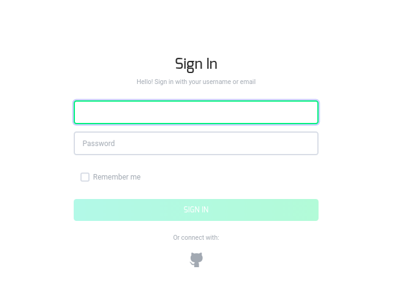
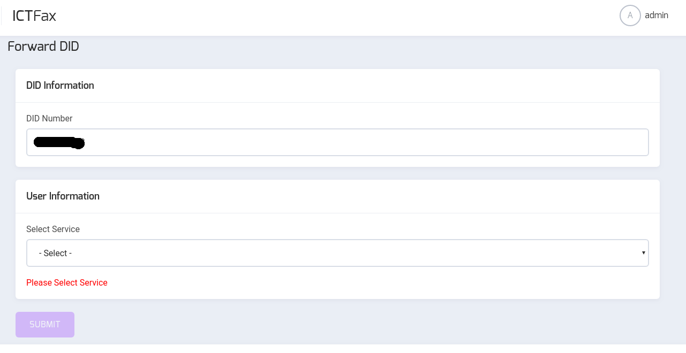

Management GUI for ICTFax
==========================

This angular based application acts as client to ICTFax, and offers basic functionality like email to fax, inbound fax, outbound fax, DIDs, Fax Campaigns and much more.

Here's a brief instruction and user guide for this application.

A Single GUI is created to cover all the major communication methods and services like:

- Send Document with multiple files (optional)
- Fax to Email
- Extension Support
- DIDs

### Features

By Using ICTFax a user can manage:

  * Contacts Management
  * Fax Documents
  * Outbound Fax
  * Inbound Fax
  * DIDs
  * Extensions
  * User Management
  * Provider / Trunks

Getting Started
---------------
### Download and install

To download and install the ICTFax follow the [Installation Guide](INSTALL.md).

## Signing In:

To start the application visit the link, a window will appear and it will ask for the username and password. Fill the required fields to Sign in. Manage all contacts, documents, inbound and outbound fax and much more features.

    

Once you have logged in successfully it will redirect you to the Home page.

### Sending your first fax

To send your first fax you need to create it as:
* Go to the Resources.
* Select Fax Documents.
* Select new Fax
* Enter details and upload the document.
* Press Submit button
* Now the document has been successfully added
* Go to Outbound Fax menu
* Select New Outbound Fax button
* Enter all of the details
* Press the submit button

Contact Management
------------------

### Contacts:

In order to manage your contacts click on the phone icon and two icons will be displayed:
* **Contacts** .

### Contacts:

In order to manage your contacts click on the phone icon a list of contacts will appear. Here you can manage all of your contacts. You can **update** contact details by clicking on the edit icon against the contact name in the list. You can also **delete** the contact by clicking on the delete icon against the contact in contact list.

In order to create the new contact click the button on the top left page of contact list. It will redirect you to the **add contact** window. Fill the required fields by entering the correct first name, last name, phone and email. Enter the correct phone number and password else it will show warning. Enter the required fields and press the submit button. A new contact will be created and it will redirect you to the list. 

Resources
------

#### Fax Document Management

To manage the Fax Document click on the **Resources**, click Fax Document it will show you the list of documents. You can **update** documents details by clicking on the edit icon against the document name in the list. You can also **delete** the document by clicking on the delete icon against the document name in document list.

In order to add the new fax document click the button on the top left page of document list. It will redirect you to **add document** window. Fill the required fields like document name, upload pdf file and any additional description and click the submit button. A new Document will be created.

In order to **Download** the document click the download icon against the document in the document list. Download of pdf file/document will be started.

Outbound Fax
------------------------
Here you can send fax to the desired contact

In order to send new Fax click the respective button. A Send Fax program window will open:
* Choose the document to be sent
* Select Contact to be sent
* Add Remarks where applicable
* Click the submit button

The fax will be sent successfully. You can view the Fax in Outbound list and can also check its status.

Inbound Fax
------------------------

Here all of the received faxes will be shown to the user. User can view the status of the each fax and can also download the desired fax by clicking the download icon against the desired fax in the Inbound Fax List.

DID Numbers
-----------

You can also define the DID Numbers in the ICTFax, create DIDs in batch assign the DID.

###### Create New DID:

In order to create the new DID

* Go to DID Numbers menu
* Select Create New DID
* Fill all of the required fields
* Press the submit button

###### Create DIDs in batch:

In order to create DIDs in batch 

* Go to DID Numbers menu
* Select Create DIDs in batch
* Fill all of the required fields
* Press the Submit button

You can also assign the DID to the user by clicking the assign icon against the desired DID in the DIDs List.
Click the icon, select the user from the list and press the submit button. DID will be assigned to the selected user.

Extensions:
-----------

ICTFax also supports the Extension management to forward the call to the extensions.

###### Create New Extension:

To create new Extension click on the extension menu, it will show you the extension list

* Click add New Extension. A form will open
* Fill all of the required fields
* Press the Submit button

You can **update** extension details by clicking on the edit icon against the extension in the list. You can also **delete** the extension by clicking on the delete icon against the extension in extension list.

User Management:
---------------

ICTFax also supports the user management.

###### Create New User:

To create new user click on the user menu, it will show you the user list

* Click add New User. A form will open
* Fill all of the required fields
* Press the Submit button

You can **update** user details by clicking on the edit icon against the user in the list. You can also **delete** the user by clicking on the delete icon against the user in user list.

Provider / Trunks:
---------------

ICTFax also supports the Provider / Trunk management to create the desired trunk.

###### Create New User:

To create new provider click on the provider menu, it will show you the provider list

* Click add New provider. A form will open
* Fill all of the required fields
* Press the Submit button

You can **update** provider details by clicking on the edit icon against the provider in the provider list. You can also **delete** the provider by clicking on the delete icon against the provider in provider list.

Incoming numbers:
---------------

We can also select the service on the incoming number in the ICTFax like fax to email and forward the did to extension.

###### Select the service on Incoming number:

To select the service on the incoming number 
* Click on the forward icon against the desired number in the incoming numbers list
* A form will open
* Select the service
* Press the submit button

Now the desired service will be assigned to the DID Number.

    

