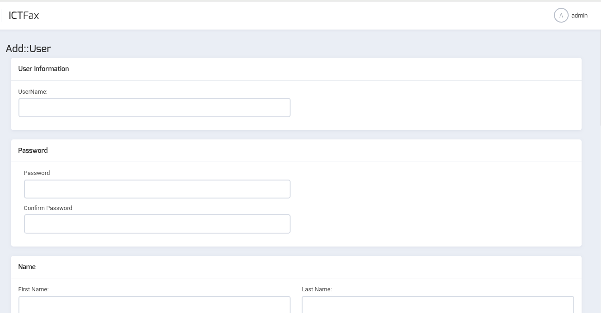
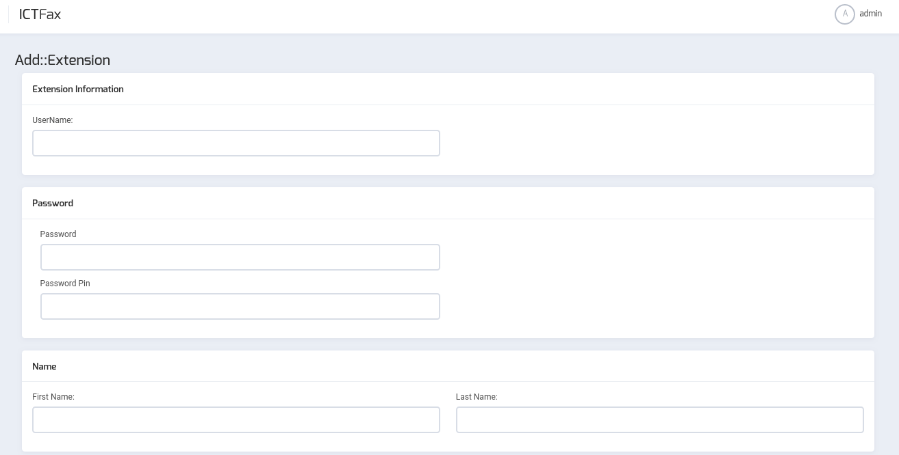

Admin Guide for ICTFax
==========================
When we build softwares our main objective is to provide ease to our Users , and make it user friendly as much as we can.

Getting Started
---------------

### Download and install

To download and install ICTFax you can follow our [Installation Guide](INSTALL.md).

For managing Provider(Trunks),Contacts and extensions, admin must login to his account. After login the page will be redirected to the main page.
Click  **Administration Icon** , placed at the bottom of the side bar on left.
Three more icons will be displayed : **Provider/ Trunk**, **Extensions** and **User Management**.

### User Management

To manage the users , User Management option is given, a list of user will appear upon clicking this icon. All the user details  can be altered by clicking **edit** button against the user name in the list.

User can be deleted by clicking the **delete**  icon against the user in the user list. In order to create the new user a button **Add user** is present on the top left page of user list which redirects to the **Add User** window. Rrequired fields for creating a new user are:

* User Name
* Password
* First name 
* Last name
* User Address
* Country and Time Zone

    

 

Hitting the **Submit** button will create a new user .
Edit icon, against the user in the user list gives the options to To **Update** the user details.

### Configure Providers

Providers can be configured by using the provider management. In order to manage providers go to the Provider management, a list of providers will appear. Here you can manage all of the providers.Provider can be deleted by clicking on the delete icon against the provider in provider list.

In order to configure the new provider the button **Add provider** is placed on the top left page of provider list. It will redirect to the **add provider** window. The required fields to be entered are :

* Provider Name (if its active , check the box infront of it)
* Gateway type(SIP for voice & Fax, SMTP for email and SMPP for SMS)
* User Name
* Password
* Host (IP Address)
* Port
* Prefix
* Weight (provider having light weight will be used more frequently) and so on.
* Additional Information, if any.

    

 

Fill all of the required fields and hit the **Submit** button it will configure a new provider and redirect to the list.

Provider details can be **updated** by clicking on the edit icon against the provider name in the list.

The provider can be obliterate from the list by  **delete** icon against the provider in provider list.
 
### Extensions

Providers can be configured by using the Extensions menu. In order to manage extensions go to the Extensions menu. Clicking this menu from the side bar will open a new window, which will display a list of the extensions.

To add the new extension click on the **Add extension** button in the extension list it will open a new form which will ask for the following required fields:

* user name
* password
* password pin
* First name 
* Last name
* phone
* email
* User Address
* a check box for Active

    

 

Fill all of the required fields and hit the **Submit** button it will configure a new extension and redirect to the list.

Extensions details can be **updated** by clicking on the edit icon against the extension name in the list.

The extension can be obliterate from the list by  **delete** icon against the extension in extension list.
 