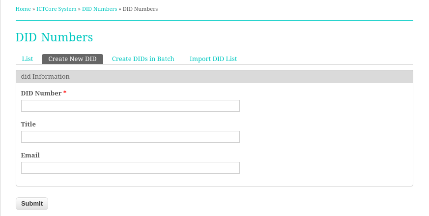
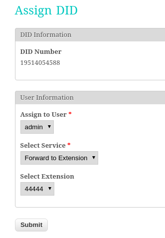
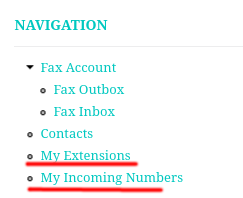
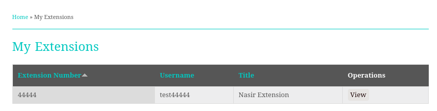
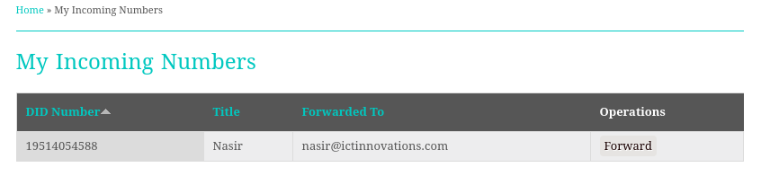
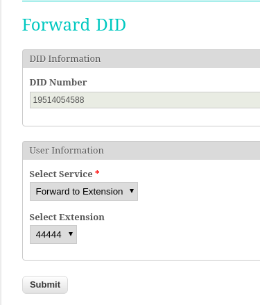

ATA Support in ICTFax
=====================

ICTFax support ATA devices, ATA support in ICTFax allow users to use existing fax machines along with ICTFax, they can attach fax machine with ATA to receive and relay outgoing faxes via ICTFax server.

Before user can receive and send faxes, admin and user has to configure ICTFax, Please check following details for configuration.

Admin Guide
-----------
Admin has to create DIDs and Extensions. then he need to assign these newly created DIDs or Extensions to selected users

### Create and assign DIDs
As admin, select **DID Numbers** from main menu. then click on **Create new DID** and fill out the form, when done click on save. and then from DID list click on **Assign** button against newly created DID and on upcoming form select desired user and click on submit.

Note: Before creating DIDs, Please visit DID provider's portal and make sure that DID are properly being forwarded to ICTFax server's IP and port 5070, please note that ICTFax uses port 5060 for internal devices and port 5070 for external SIP gateways.

  

  

### Create and assign Extensions
The process is same as for the DID, admin have select **Extension** from menu and then **Create new Extension** and then **Assign**.

### System configuration
Please check /etc/ictcore.conf file and confirm that **host** and **port** values are correctly reflecting SIP server location. i.e the host and port of Freeswitch server. Normally host will be same as IP address of ICTFax server and port will be 5060.

User Guide
----------
User can view Extension configuration or can configure assigned DID by selecting **My Extensions** or **My Incoming numbers** from main menu respectively.

  

### Sending Fax via ATA
User can configure ICTFax and fax machines for outgoing faxes as following

1. Click **My Extensions** from main menu
2. Click on **View** against selected extension
3. Note extension configurations, especially username, password, host and port number
4. Connect ATA with network and Fax machine with ATA
5. Open ATA's web configuration portal and configure it as per extensions configurations.

Now user can dial destination number from fax machines and can continue with fax sending process.

  

### Receiving Fax via ATA
To receive faxs at fax machines, user has to forward his DID number to extension from ICTFax GUI. Please check following for more details.

1. Visit **My Incoming numbers** from main menu.
2. Select **Forward** against selected DID
3. In resultant form select **Forward to Extension** and then select target extension from underneath select field.
4. Click on submit to save new configuration

Note: user still have to configure his ATA with selected extension, as per the instruction given above in Sending Fax section.

  

  

